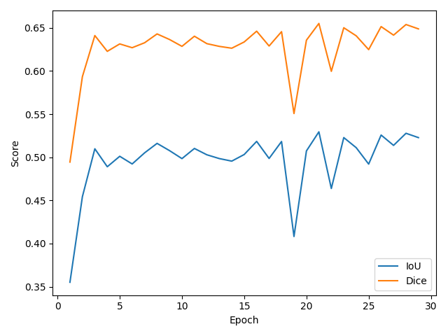
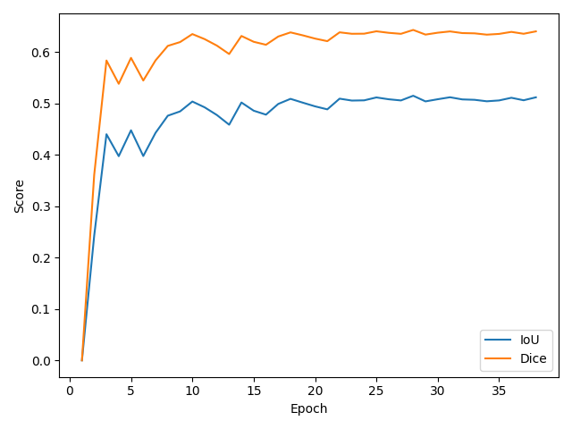
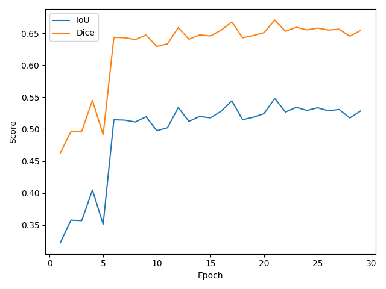

Crack Segmentation (CPU Only, Windows Friendly)

Why this repo
- Simple, reproducible crack segmentation on CPU-only machines.
- Three practical model choices: ED-Plus, U-Net Mini, and SegFormer-Lite.
- Human-friendly recipes and visuals so you can get results fast.

Models at a Glance
- ED-Plus (a.k.a. scratch_ed_plus): lightweight encoder–decoder tuned for speed and strong baselines on thin structures like cracks. Great when you want a fast, compact model without transformers.
- U-Net Mini: classic U-Net downsized for CPU training; strong baseline with skip connections and a simple decoder. Add dropout for better generalization.
- SegFormer-Lite: transformer-based encoder (from timm) with a lightweight head; best capacity when you can afford a bit more compute.

Training Curves (from runs)

Repository Layout
- crackseg/
  - data/: dataset loader, augmentations, I/O helpers
  - models/: ED/ScratchED family, U-Net Mini, optional SegFormer-Lite head
  - losses.py, metrics.py
  - train.py, evaluate.py, infer.py, vis.py
  - config.yaml
- Root wrappers: train.py, evaluate.py, infer.py (call into crackseg/*)

Requirements (CPU only)
- Python >= 3.9
- PyTorch (CPU wheels)
- OpenCV-Python
- pycocotools-windows (Windows) or pycocotools (Linux/macOS)
- numpy, pyyaml, tqdm, matplotlib

Installation (Windows PowerShell)
1) Create a virtual environment
   `python -m venv .venv`
   `.\.venv\Scripts\Activate.ps1`
2) Install dependencies (CPU wheels)
   `pip install torch torchvision torchaudio --index-url https://download.pytorch.org/whl/cpu`
   `pip install opencv-python numpy pyyaml tqdm matplotlib`
   `pip install pycocotools-windows`  # Windows (Linux/mac: `pip install pycocotools`)

Dataset Setup (COCO per split)
`<DATA_ROOT>/`
  `train/`
    `_annotations.coco.json`
    `*.jpg`
  `valid/`
    `_annotations.coco.json`
    `*.jpg`
  `test/`
    `_annotations.coco.json`
    `*.jpg`

Binary rule: positive = any category whose name contains "crack" (case-insensitive). All else is background. Masks are unions of positive polygons (annToMask) with fallback to bbox.

Config
- Edit `crackseg/config.yaml` (CPU defaults included):
  - `DATA_ROOT`: absolute path to your dataset (or use sample_data for a smoke test)
  - `IMG_SIZE`: 512 (use 256 on CPU for speed)
  - `BATCH_SIZE`: 2, `NUM_WORKERS`: 0 (Windows-safe)
  - `EPOCHS`: 30 (increase later)
  - `MODEL_NAME`: `scratch_ed_plus | unet_mini | unet_mini_dropout | segformer_lite`
  - `LOSS`: `bce_dice` (default), threshold: 0.5

Quick Start
1) Set `DATA_ROOT` in `crackseg/config.yaml`
2) Train your chosen model (see commands below)
3) Evaluate on test split
4) Run inference to export overlays

Model Guides (with commands)

ED-Plus (alias: `scratch_ed_plus`)
- Train (no dropout):
  `python -m crackseg.train --config crackseg/config.yaml --model scratch_ed_plus --dropout 0.0`
- Train (with dropout, e.g., 0.3):
  `python -m crackseg.train --config crackseg/config.yaml --model scratch_ed_plus --dropout 0.3`
- Evaluate:
  `python -m crackseg.evaluate --config crackseg/config.yaml --weights runs/scratch_ed_plus/best.pth --model scratch_ed_plus`
- Infer on folder:
  `python -m crackseg.infer --config crackseg/config.yaml --weights runs/scratch_ed_plus/best.pth --model scratch_ed_plus --input <DATA_ROOT>/test --save ./outputs/infer_scratch_plus`

U-Net Mini (baseline)
- Train:
  `python -m crackseg.train --config crackseg/config.yaml --model unet_mini`
- Train + Dropout (e.g., 0.3):
  `python -m crackseg.train --config crackseg/config.yaml --model unet_mini_dropout --dropout 0.3`
- Evaluate:
  `python -m crackseg.evaluate --config crackseg/config.yaml --weights runs/unet_mini/best.pth --model unet_mini`
- Infer on folder:
  `python -m crackseg.infer --config crackseg/config.yaml --weights runs/unet_mini/best.pth --model unet_mini --input <DATA_ROOT>/test --save ./outputs/infer_unet`

SegFormer-Lite (requires `timm`)
- Install backbone zoo:
  `pip install timm`
- Train (with encoder + pretrained):
  `python -m crackseg.train --config crackseg/config.yaml --model segformer_lite --encoder segformer_b0 --pretrained 1`
- Freeze warm-up + dual LR groups:
  `python -m crackseg.train --config crackseg/config.yaml --model segformer_lite --encoder segformer_b0 --pretrained 1 --freeze-epochs 5 --lr-head 1e-3 --lr-encoder 1e-4`
- Evaluate:
  `python -m crackseg.evaluate --config crackseg/config.yaml --weights runs/segformer_lite/best.pth --model segformer_lite --encoder segformer_b0 --pretrained 1`
- Infer on folder:
  `python -m crackseg.infer --config crackseg/config.yaml --weights runs/segformer_lite/best.pth --model segformer_lite --encoder segformer_b0 --pretrained 1 --input <DATA_ROOT>/test --save ./outputs/infer_segformer`

Outputs
- `runs/<model_name>/`: `best.pth`, `config_snapshot.yaml`, `logs.csv`, `plots/`, `visuals/`
- `outputs/metrics_test.json` (from `evaluate.py`)

Visualizations
- Training saves curves and 8 qualitative triptychs under `runs/<model_name>/`.
- Regenerate curves from `logs.csv`:
  `python -c "from crackseg.vis import plot_curves; import pathlib; plot_curves(pathlib.Path('runs/unet_mini/logs.csv'), pathlib.Path('runs/unet_mini/plots'))"`

Reproducibility & Determinism
- Seeds for random/numpy/torch set to 42; cuDNN flags are guarded and disabled on CPU.
- AMP disabled on CPU; gradient clipping enabled.

Troubleshooting
- pycocotools error on Windows: `pip install pycocotools-windows`
- Slow CPU: set `IMG_SIZE=256`, `EPOCHS=10` for quick tests.
- Memory errors: lower `BATCH_SIZE` or `IMG_SIZE`.
- Empty masks: check category names in your COCO file (must contain "crack").

Learn As You Go
- Explore IoU/Dice, failure cases (thin cracks, low contrast).
- Try different base channels for U-Net and compare speed vs. quality.
- Swap loss (BCE+Dice vs. Focal/Tversky) for class imbalance.
- Adjust augmentation strength; masks always use nearest-neighbor.
- Tune threshold (0.3–0.7) to trade precision/recall.

Sample Data (smoke tests)
- Generate a tiny synthetic COCO set:
  `python crackseg/tools/generate_sample_data.py`
- Set `DATA_ROOT: ./crackseg/sample_data` and run a short training.

Notes on Augmentation
- Online, OpenCV-only augmentations (rotate ±30°, scale 0.8–1.2, brightness/contrast ±20%, Gaussian noise σ≈10/255) apply to train split only.
- Intensity/duplication controlled by `AUG_MULTIPLIER` in YAML (e.g., 5).

Official Offline Aug Audit (do not use for metrics)
`python crackseg/tools/offline_augment.py --config crackseg/config.yaml --split train --save ./outputs/offline_aug5_train --seed 42`
`python crackseg/tools/offline_augment.py --config crackseg/config.yaml --split valid --save ./outputs/offline_aug5_valid --seed 42`
`python crackseg/tools/offline_augment.py --config crackseg/config.yaml --split test  --save ./outputs/offline_aug5_test  --seed 42`

