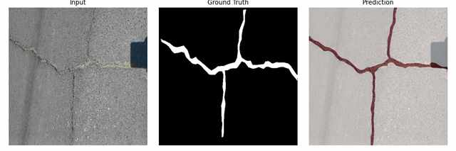

# Crack Segmentation

CPU-friendly pavement / concrete **crack segmentation** with three models: **ED-Plus**, **U-Net Mini**, **SegFormer-Lite**.

Course / applied CV project. Real training logs committed under `runs/`.

## Dataset

COCO-style splits (`train` / `valid` / `test`) with `_annotations.coco.json`.  
Positive class = any category whose name contains `crack`.

**Public dataset links (same problem family · export COCO Segmentation):**

- [Roboflow Universe — crack (university-bswxt/crack-bphdr)](https://universe.roboflow.com/university-bswxt/crack-bphdr)  
- [Ultralytics Crack-Seg](https://docs.ultralytics.com/datasets/segment/crack-seg/) (~4k images; based on Roboflow crack data)

After download/export, point `DATA_ROOT` in `crackseg/config.yaml` at the folder that contains `train/`, `valid/`, `test/`.

## Results (validation, from committed `runs/*/logs.csv`)

| Model | Best val IoU | Best val Dice | Epoch |
|-------|--------------|---------------|-------|
| **SegFormer-Lite** | **0.548** | **0.670** | 21 |
| ED-Plus (`scratch_ed_plus`) | 0.529 | 0.655 | 21 |
| U-Net Mini | 0.515 | 0.643 | 28 |

These are **validation** curves during training — not a frozen public test leaderboard. Weights (`.pth`) are not in git (large); logs + qualitative figs are.





Curves: `docs/images/*_metrics.png`

## Models

- **ED-Plus** — light encoder–decoder for thin cracks  
- **U-Net Mini** — small U-Net baseline (+ optional dropout)  
- **SegFormer-Lite** — `timm` SegFormer-B0 + light head  

Loss: BCE + Dice. Seed 42.

## Quick start

```bash
python -m venv .venv && source .venv/bin/activate
pip install torch torchvision --index-url https://download.pytorch.org/whl/cpu
pip install opencv-python numpy pyyaml tqdm matplotlib pycocotools
# optional SegFormer: pip install timm

# set DATA_ROOT in crackseg/config.yaml
python -m crackseg.train --config crackseg/config.yaml --model segformer_lite --encoder segformer_b0 --pretrained 1
python -m crackseg.evaluate --config crackseg/config.yaml --weights runs/segformer_lite/best.pth --model segformer_lite --encoder segformer_b0
python -m crackseg.infer --config crackseg/config.yaml --weights runs/segformer_lite/best.pth --model segformer_lite --input "$DATA_ROOT/test" --save ./outputs/infer
```

More recipes: `COMMANDS.txt`.

## Layout

```
crackseg/     package (data, models, train/eval/infer)
runs/         training logs per model
docs/images/  samples + metric plots
```
