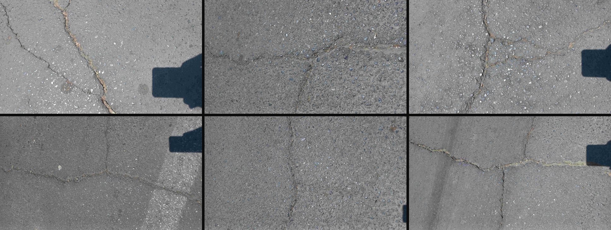
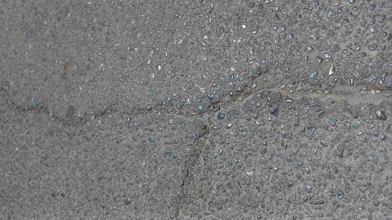
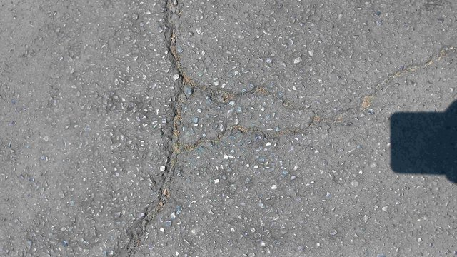
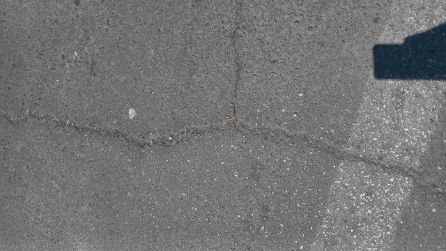
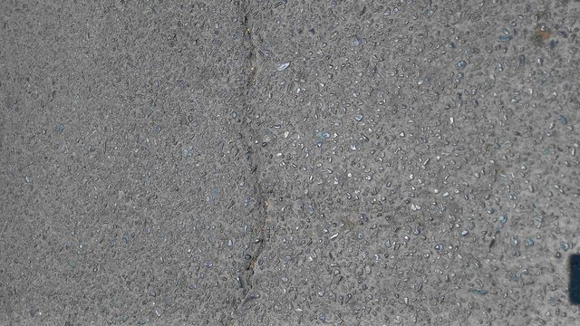
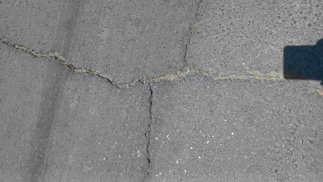

# Crack Segmentation

CPU-friendly pavement / concrete **crack segmentation** with three models: **ED-Plus**, **U-Net Mini**, **SegFormer-Lite**.

Course / applied CV project. Real training logs under `runs/`.

## Dataset (ours)

We built and curated this dataset ourselves for the course project (COCO segmentation export on Roboflow).

- **Corrected export (v3 / version2):** misaligned image–mask pairs were fixed.
- Credit for mask alignment cleanup: **Mr. Seyfouri (آقای صیفوری)**.
- Format: COCO per split (`train` / `valid` / `test` + `_annotations.coco.json`).
- Positive class = any category whose name contains `crack`.

**Download (corrected version):**

```bash
curl -L "https://app.roboflow.com/ds/035L0MXWQ7?key=Ar7SlkKyBk" > roboflow.zip
unzip roboflow.zip && rm roboflow.zip
```

Direct link: [Roboflow export `035L0MXWQ7`](https://app.roboflow.com/ds/035L0MXWQ7?key=Ar7SlkKyBk)  
Export name: `crack segmentation.v3-version2` (COCO segmentation).

Point `DATA_ROOT` in `crackseg/config.yaml` at the unzipped folder.

### Dataset samples (from our corrected test split)



| | | |
|:---:|:---:|:---:|
|  |  |  |
|  |  |  |

## Results (validation, from committed `runs/*/logs.csv`)

| Model | Best val IoU | Best val Dice | Epoch |
|-------|--------------|---------------|-------|
| **SegFormer-Lite** | **0.548** | **0.670** | 21 |
| ED-Plus (`scratch_ed_plus`) | 0.529 | 0.655 | 21 |
| U-Net Mini | 0.515 | 0.643 | 28 |

Validation curves during training — not a public test leaderboard. Weights (`.pth`) not in git; logs + figs are.

### Qualitative predictions


## Models

- **ED-Plus** — light encoder–decoder for thin cracks  
- **U-Net Mini** — small U-Net baseline (+ optional dropout)  
- **SegFormer-Lite** — `timm` SegFormer-B0 + light head  

Loss: BCE + Dice. Seed 42.

## Quick start

```bash
python -m venv .venv && source .venv/bin/activate
pip install torch torchvision --index-url https://download.pytorch.org/whl/cpu
pip install opencv-python numpy pyyaml tqdm matplotlib pycocotools
# optional SegFormer: pip install timm

# download dataset (see above), set DATA_ROOT in crackseg/config.yaml
python -m crackseg.train --config crackseg/config.yaml --model segformer_lite --encoder segformer_b0 --pretrained 1
python -m crackseg.evaluate --config crackseg/config.yaml --weights runs/segformer_lite/best.pth --model segformer_lite --encoder segformer_b0
python -m crackseg.infer --config crackseg/config.yaml --weights runs/segformer_lite/best.pth --model segformer_lite --input "$DATA_ROOT/test" --save ./outputs/infer
```

More recipes: `COMMANDS.txt`.

## Layout

```
crackseg/                      package (data, models, train/eval/infer)
runs/                          training logs per model
docs/images/                   prediction samples + metric plots
docs/images/dataset_samples/   raw frames from our corrected dataset
```
